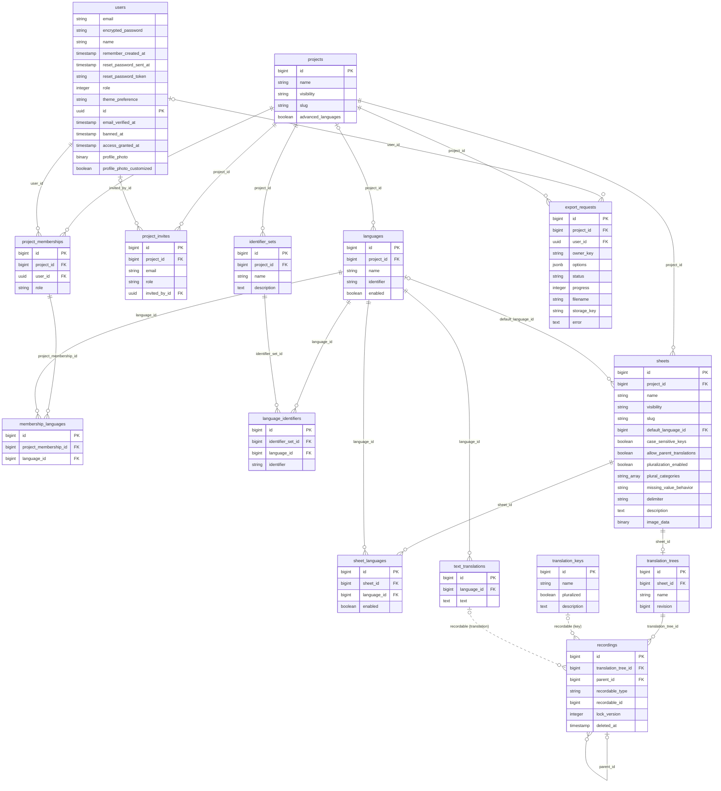
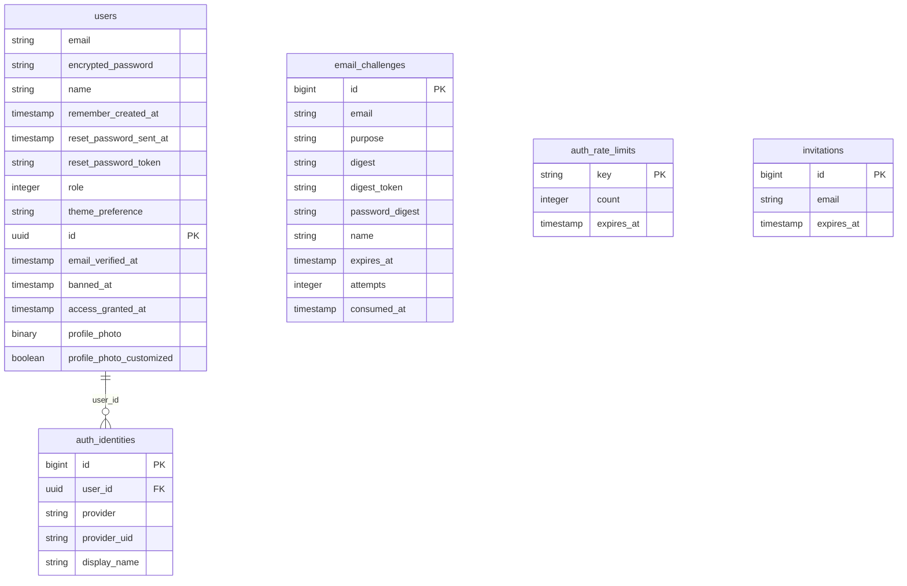
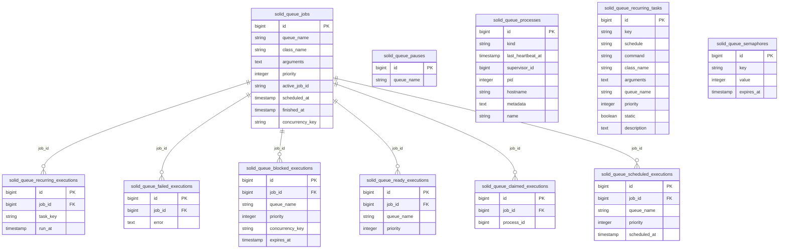

# Current database model

Generated from `db/structure.sql` after migration `20260921000000` (21 September 2026). This documents the implemented database, not a proposed redesign.

- A **project** contains sheets, memberships, languages and identifier sets.
- Each sheet currently has **one translation tree** (enforced by a unique index). Branches are not implemented.
- A recording owns the stable identity, parent pointer, payload pointer, deletion timestamp and lock version. Its immutable payload is either a translation key or a text translation. Dashed payload links below are polymorphic, checked by database triggers rather than ordinary foreign keys; each recording selects exactly one type.
- Languages remain independent of names/identifiers. `languages.identifier` is still stored as a base identifier; `language_identifiers` stores export identifiers per set.
- Sheet images are optional WebP bytes in `sheets.image_data`, using the existing image conversion path; there is no Active Storage image table.
- `export_requests.options` stores selected sheet/language IDs and format settings as JSON, not additional join tables. Solid Queue receives the export ID in its job arguments; there is no foreign key between jobs and exports.

Non-user entity IDs and their foreign keys are `bigint`; user IDs and user foreign keys remain UUIDs. `numeric_id_mappings` is migration-only rollback metadata (table name, old UUID, new bigint), not an application model.

## Application data



## Authentication and older tables



## Background-job infrastructure



## Storage notes

- `sheet_languages` restricts a language to selected sheets. `languages.enabled = true` means all sheets; otherwise enabled sheet-language rows specify availability.
- `membership_languages` assigns editing languages to a project membership.
- `invitations` is an older standalone email/expiry table with no current Active Record model. It is distinct from the active `project_invites` table.
- `email_challenges` and `auth_rate_limits` are keyed by email or a rate-limit key, with no user foreign key.
- Rails also keeps `schema_migrations` and `ar_internal_metadata`. Creation/update timestamps are omitted from the diagrams for readability.

## Exact columns

The following includes timestamps and database defaults. Foreign keys, indexes and triggers are defined in `db/structure.sql`.

<details><summary>ar_internal_metadata</summary>

```sql
CREATE TABLE ar_internal_metadata (
    key character varying NOT NULL,
    value character varying,
    created_at timestamp(6) without time zone NOT NULL,
    updated_at timestamp(6) without time zone NOT NULL
);
```

</details>

<details><summary>auth_identities</summary>

```sql
CREATE TABLE auth_identities (
    id bigint DEFAULT gen_random_uuid() NOT NULL,
    user_id bigint NOT NULL,
    provider character varying NOT NULL,
    provider_uid character varying NOT NULL,
    created_at timestamp(6) without time zone NOT NULL,
    updated_at timestamp(6) without time zone NOT NULL,
    display_name character varying
);
```

</details>

<details><summary>auth_rate_limits</summary>

```sql
CREATE TABLE auth_rate_limits (
    key character varying NOT NULL,
    count integer DEFAULT 0 NOT NULL,
    expires_at timestamp(6) without time zone NOT NULL
);
```

</details>

<details><summary>email_challenges</summary>

```sql
CREATE TABLE email_challenges (
    id bigint DEFAULT gen_random_uuid() NOT NULL,
    email character varying NOT NULL,
    purpose character varying NOT NULL,
    digest character varying NOT NULL,
    password_digest character varying,
    name character varying,
    expires_at timestamp(6) without time zone NOT NULL,
    attempts integer DEFAULT 0 NOT NULL,
    consumed_at timestamp(6) without time zone,
    created_at timestamp(6) without time zone NOT NULL,
    updated_at timestamp(6) without time zone NOT NULL
);
```

</details>

<details><summary>export_requests</summary>

```sql
CREATE TABLE export_requests (
    id bigint DEFAULT gen_random_uuid() NOT NULL,
    project_id bigint NOT NULL,
    user_id uuid,
    owner_key character varying NOT NULL,
    options jsonb DEFAULT '{}'::jsonb NOT NULL,
    status character varying DEFAULT 'queued'::character varying NOT NULL,
    progress integer DEFAULT 0 NOT NULL,
    filename character varying,
    error text,
    created_at timestamp(6) without time zone NOT NULL,
    updated_at timestamp(6) without time zone NOT NULL
);
```

</details>

<details><summary>identifier_sets</summary>

```sql
CREATE TABLE identifier_sets (
    id bigint DEFAULT gen_random_uuid() NOT NULL,
    project_id bigint NOT NULL,
    name character varying NOT NULL,
    description text,
    created_at timestamp(6) without time zone NOT NULL,
    updated_at timestamp(6) without time zone NOT NULL
);
```

</details>

<details><summary>invitations</summary>

```sql
CREATE TABLE invitations (
    id bigint DEFAULT gen_random_uuid() NOT NULL,
    email character varying NOT NULL,
    expires_at timestamp(6) without time zone NOT NULL,
    created_at timestamp(6) without time zone NOT NULL,
    updated_at timestamp(6) without time zone NOT NULL
);
```

</details>

<details><summary>language_identifiers</summary>

```sql
CREATE TABLE language_identifiers (
    id bigint DEFAULT gen_random_uuid() NOT NULL,
    identifier_set_id bigint NOT NULL,
    language_id bigint NOT NULL,
    identifier character varying NOT NULL,
    created_at timestamp(6) without time zone NOT NULL,
    updated_at timestamp(6) without time zone NOT NULL
);
```

</details>

<details><summary>languages</summary>

```sql
CREATE TABLE languages (
    id bigint DEFAULT gen_random_uuid() NOT NULL,
    project_id uuid,
    name character varying NOT NULL,
    identifier character varying NOT NULL,
    enabled boolean DEFAULT false NOT NULL,
    created_at timestamp(6) without time zone NOT NULL,
    updated_at timestamp(6) without time zone NOT NULL,
    CONSTRAINT language_identity CHECK (((length((name)::text) > 0) AND ((identifier)::text ~ '^[a-z0-9]+([-_][a-z0-9]+)*$'::text)))
);
```

</details>

<details><summary>membership_languages</summary>

```sql
CREATE TABLE membership_languages (
    id bigint DEFAULT gen_random_uuid() NOT NULL,
    project_membership_id bigint NOT NULL,
    language_id bigint NOT NULL
);
```

</details>

<details><summary>project_invites</summary>

```sql
CREATE TABLE project_invites (
    id bigint DEFAULT gen_random_uuid() NOT NULL,
    project_id bigint NOT NULL,
    email character varying NOT NULL,
    created_at timestamp(6) without time zone NOT NULL,
    updated_at timestamp(6) without time zone NOT NULL,
    role character varying DEFAULT 'viewer'::character varying NOT NULL,
    invited_by_id uuid,
    CONSTRAINT project_invite_role CHECK (((role)::text = ANY ((ARRAY['viewer'::character varying, 'translator'::character varying])::text[])))
);
```

</details>

<details><summary>project_memberships</summary>

```sql
CREATE TABLE project_memberships (
    id bigint DEFAULT gen_random_uuid() NOT NULL,
    project_id bigint NOT NULL,
    user_id bigint NOT NULL,
    role character varying DEFAULT 'viewer'::character varying NOT NULL,
    created_at timestamp(6) without time zone NOT NULL,
    updated_at timestamp(6) without time zone NOT NULL,
    CONSTRAINT project_membership_role CHECK (((role)::text = ANY ((ARRAY['viewer'::character varying, 'translator'::character varying, 'admin'::character varying, 'owner'::character varying])::text[])))
);
```

</details>

<details><summary>projects</summary>

```sql
CREATE TABLE projects (
    id bigint DEFAULT gen_random_uuid() NOT NULL,
    name character varying NOT NULL,
    visibility character varying DEFAULT 'private'::character varying NOT NULL,
    created_at timestamp(6) without time zone NOT NULL,
    updated_at timestamp(6) without time zone NOT NULL,
    slug character varying NOT NULL,
    advanced_languages boolean DEFAULT false NOT NULL,
    CONSTRAINT projects_slug_format CHECK ((((slug)::text ~ '^[a-z0-9]+([-_][a-z0-9]+)*$'::text) AND (length((slug)::text) <= 100) AND ((slug)::text <> ALL ((ARRAY['new'::character varying, 'edit'::character varying])::text[])))),
    CONSTRAINT projects_visibility CHECK (((visibility)::text = ANY ((ARRAY['public'::character varying, 'private'::character varying])::text[])))
);
```

</details>

<details><summary>recordings</summary>

```sql
CREATE TABLE recordings (
    id bigint DEFAULT gen_random_uuid() NOT NULL,
    translation_tree_id bigint NOT NULL,
    parent_id uuid,
    recordable_type character varying NOT NULL,
    recordable_id bigint NOT NULL,
    lock_version integer DEFAULT 0 NOT NULL,
    deleted_at timestamp(6) without time zone,
    created_at timestamp(6) without time zone NOT NULL,
    updated_at timestamp(6) without time zone NOT NULL,
    CONSTRAINT recording_type_parent CHECK ((((recordable_type)::text = ANY ((ARRAY['TranslationKey'::character varying, 'TextTranslation'::character varying])::text[])) AND ((parent_id IS NULL) OR (parent_id <> id))))
);
```

</details>

<details><summary>schema_migrations</summary>

```sql
CREATE TABLE schema_migrations (
    version character varying NOT NULL
);
```

</details>

<details><summary>sheet_languages</summary>

```sql
CREATE TABLE sheet_languages (
    id bigint DEFAULT gen_random_uuid() NOT NULL,
    sheet_id bigint NOT NULL,
    language_id bigint NOT NULL,
    enabled boolean DEFAULT true NOT NULL
);
```

</details>

<details><summary>sheets</summary>

```sql
CREATE TABLE sheets (
    id bigint DEFAULT gen_random_uuid() NOT NULL,
    project_id bigint NOT NULL,
    name character varying NOT NULL,
    visibility character varying DEFAULT 'private'::character varying NOT NULL,
    created_at timestamp(6) without time zone NOT NULL,
    updated_at timestamp(6) without time zone NOT NULL,
    slug character varying NOT NULL,
    default_language_id uuid,
    case_sensitive_keys boolean DEFAULT false NOT NULL,
    allow_parent_translations boolean DEFAULT false NOT NULL,
    pluralization_enabled boolean DEFAULT true NOT NULL,
    plural_categories character varying[] DEFAULT '{zero,one,two,few,many,other}'::character varying[] NOT NULL,
    missing_value_behavior character varying DEFAULT 'omit'::character varying NOT NULL,
    delimiter character varying DEFAULT '.'::character varying NOT NULL,
    description text,
    image_data bytea,
    CONSTRAINT sheet_delimiter_character CHECK (((char_length((delimiter)::text) >= 1) AND (char_length((delimiter)::text) <= 3))),
    CONSTRAINT sheet_missing_values CHECK (((missing_value_behavior)::text = ANY ((ARRAY['omit'::character varying, 'empty'::character varying, 'fallback'::character varying])::text[]))),
    CONSTRAINT sheets_slug_format CHECK ((((slug)::text ~ '^[a-z0-9]+([-_][a-z0-9]+)*$'::text) AND (length((slug)::text) <= 100) AND ((slug)::text <> ALL ((ARRAY['new'::character varying, 'edit'::character varying])::text[])))),
    CONSTRAINT sheets_visibility CHECK (((visibility)::text = ANY ((ARRAY['public'::character varying, 'private'::character varying])::text[])))
);
```

</details>

<details><summary>solid_queue_blocked_executions</summary>

```sql
CREATE TABLE solid_queue_blocked_executions (
    id bigint NOT NULL,
    job_id bigint NOT NULL,
    queue_name character varying NOT NULL,
    priority integer DEFAULT 0 NOT NULL,
    concurrency_key character varying NOT NULL,
    expires_at timestamp(6) without time zone NOT NULL,
    created_at timestamp(6) without time zone NOT NULL
);
```

</details>

<details><summary>solid_queue_claimed_executions</summary>

```sql
CREATE TABLE solid_queue_claimed_executions (
    id bigint NOT NULL,
    job_id bigint NOT NULL,
    process_id bigint,
    created_at timestamp(6) without time zone NOT NULL
);
```

</details>

<details><summary>solid_queue_failed_executions</summary>

```sql
CREATE TABLE solid_queue_failed_executions (
    id bigint NOT NULL,
    job_id bigint NOT NULL,
    error text,
    created_at timestamp(6) without time zone NOT NULL
);
```

</details>

<details><summary>solid_queue_jobs</summary>

```sql
CREATE TABLE solid_queue_jobs (
    id bigint NOT NULL,
    queue_name character varying NOT NULL,
    class_name character varying NOT NULL,
    arguments text,
    priority integer DEFAULT 0 NOT NULL,
    active_job_id character varying,
    scheduled_at timestamp(6) without time zone,
    finished_at timestamp(6) without time zone,
    concurrency_key character varying,
    created_at timestamp(6) without time zone NOT NULL,
    updated_at timestamp(6) without time zone NOT NULL
);
```

</details>

<details><summary>solid_queue_pauses</summary>

```sql
CREATE TABLE solid_queue_pauses (
    id bigint NOT NULL,
    queue_name character varying NOT NULL,
    created_at timestamp(6) without time zone NOT NULL
);
```

</details>

<details><summary>solid_queue_processes</summary>

```sql
CREATE TABLE solid_queue_processes (
    id bigint NOT NULL,
    kind character varying NOT NULL,
    last_heartbeat_at timestamp(6) without time zone NOT NULL,
    supervisor_id bigint,
    pid integer NOT NULL,
    hostname character varying,
    metadata text,
    created_at timestamp(6) without time zone NOT NULL,
    name character varying NOT NULL
);
```

</details>

<details><summary>solid_queue_ready_executions</summary>

```sql
CREATE TABLE solid_queue_ready_executions (
    id bigint NOT NULL,
    job_id bigint NOT NULL,
    queue_name character varying NOT NULL,
    priority integer DEFAULT 0 NOT NULL,
    created_at timestamp(6) without time zone NOT NULL
);
```

</details>

<details><summary>solid_queue_recurring_executions</summary>

```sql
CREATE TABLE solid_queue_recurring_executions (
    id bigint NOT NULL,
    job_id bigint NOT NULL,
    task_key character varying NOT NULL,
    run_at timestamp(6) without time zone NOT NULL,
    created_at timestamp(6) without time zone NOT NULL
);
```

</details>

<details><summary>solid_queue_recurring_tasks</summary>

```sql
CREATE TABLE solid_queue_recurring_tasks (
    id bigint NOT NULL,
    key character varying NOT NULL,
    schedule character varying NOT NULL,
    command character varying(2048),
    class_name character varying,
    arguments text,
    queue_name character varying,
    priority integer DEFAULT 0,
    static boolean DEFAULT true NOT NULL,
    description text,
    created_at timestamp(6) without time zone NOT NULL,
    updated_at timestamp(6) without time zone NOT NULL
);
```

</details>

<details><summary>solid_queue_scheduled_executions</summary>

```sql
CREATE TABLE solid_queue_scheduled_executions (
    id bigint NOT NULL,
    job_id bigint NOT NULL,
    queue_name character varying NOT NULL,
    priority integer DEFAULT 0 NOT NULL,
    scheduled_at timestamp(6) without time zone NOT NULL,
    created_at timestamp(6) without time zone NOT NULL
);
```

</details>

<details><summary>solid_queue_semaphores</summary>

```sql
CREATE TABLE solid_queue_semaphores (
    id bigint NOT NULL,
    key character varying NOT NULL,
    value integer DEFAULT 1 NOT NULL,
    expires_at timestamp(6) without time zone NOT NULL,
    created_at timestamp(6) without time zone NOT NULL,
    updated_at timestamp(6) without time zone NOT NULL
);
```

</details>

<details><summary>text_translations</summary>

```sql
CREATE TABLE text_translations (
    id bigint DEFAULT gen_random_uuid() NOT NULL,
    language_id bigint NOT NULL,
    text text NOT NULL,
    created_at timestamp(6) without time zone NOT NULL,
    updated_at timestamp(6) without time zone NOT NULL,
    CONSTRAINT translation_nonempty CHECK ((length(text) > 0))
);
```

</details>

<details><summary>translation_keys</summary>

```sql
CREATE TABLE translation_keys (
    id bigint DEFAULT gen_random_uuid() NOT NULL,
    name character varying NOT NULL,
    pluralized boolean DEFAULT false NOT NULL,
    created_at timestamp(6) without time zone NOT NULL,
    updated_at timestamp(6) without time zone NOT NULL,
    description text DEFAULT ''::text NOT NULL,
    CONSTRAINT key_name_length CHECK (((length((name)::text) >= 1) AND (length((name)::text) <= 200)))
);
```

</details>

<details><summary>translation_trees</summary>

```sql
CREATE TABLE translation_trees (
    id bigint DEFAULT gen_random_uuid() NOT NULL,
    sheet_id bigint NOT NULL,
    name character varying DEFAULT 'main'::character varying NOT NULL,
    revision bigint DEFAULT 0 NOT NULL,
    created_at timestamp(6) without time zone NOT NULL,
    updated_at timestamp(6) without time zone NOT NULL
);
```

</details>

<details><summary>users</summary>

```sql
CREATE TABLE users (
    email character varying NOT NULL,
    encrypted_password character varying DEFAULT ''::character varying NOT NULL,
    name character varying,
    remember_created_at timestamp(6) without time zone,
    reset_password_sent_at timestamp(6) without time zone,
    reset_password_token character varying,
    role integer DEFAULT 0 NOT NULL,
    theme_preference character varying DEFAULT 'system'::character varying NOT NULL,
    created_at timestamp(6) without time zone NOT NULL,
    updated_at timestamp(6) without time zone NOT NULL,
    id bigint DEFAULT gen_random_uuid() NOT NULL,
    email_verified_at timestamp(6) without time zone,
    banned_at timestamp(6) without time zone,
    access_granted_at timestamp(6) without time zone,
    profile_photo bytea,
    profile_photo_customized boolean DEFAULT false NOT NULL
);
```

</details>

